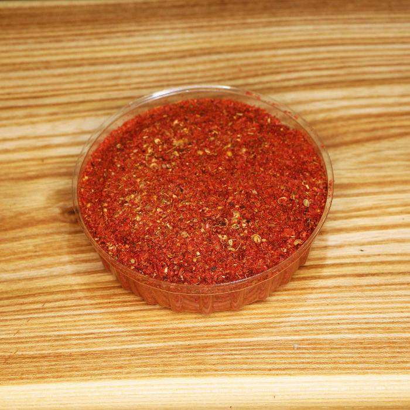

## Image resize example

### Scalr library
```xml
<!-- https://mvnrepository.com/artifact/org.imgscalr/imgscalr-lib -->
<dependency>
    <groupId>org.imgscalr</groupId>
    <artifactId>imgscalr-lib</artifactId>
    <version>4.2</version>
</dependency>
```

### Example code

```java
public class Example {
    public static void main(String[] args) throws IOException {
        BufferedImage baseImage = readSampleImage();
        BufferedImage newImage = Scalr.resize(baseImage, 700);
        ImageIO.write(newImage, "jpg", new File("newImage-700-700.jpg"));
        ImageIO.write(baseImage, "jpg", new File("baseImage.jpg"));

    }

    public static BufferedImage readSampleImage() throws IOException {
        return ImageIO.read(Objects.requireNonNull(Example.class.getClassLoader().getResource("sample-image.jpg")));
    }
}
```


### Example

*base image 2568x2568 609 KB*


*optimized image 700-700 91 KB*

